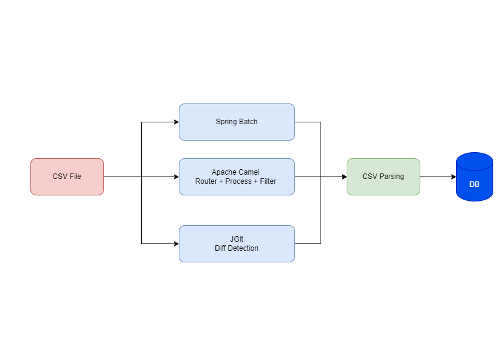

x# Large file reading challenge

Welcome in the recruitment challenge.
Write an application that, at the endpoint specified by you, returns the yearly average temperatures for a given city in the format array of objects with the following fields: year, averageTemperature.

## Assumptions

- CSV file with data is no less than 3GB in size.
- The file represents temperature measurements in the format city;yyyy-mm-dd HH:mm:ss.SSS;temp
- The content of the source file may change during the application's running

## Example source file
[example_file.csv](inputs/example_file.csv)


## Example response
```json
[
  {
	"year": "2021",
	"averageTemperature": 12.1
  },
  {
	"year": "2022",
	"averageTemperature": 11.1
  },
  {
	"year": "2023",
	"averageTemperature": 14.1
  }
]
```

## Requirements
- Source code should be placed in a public repository (e.g. GitHub, GitLab, Bitbucket)

## Tips
Feel free you use any libraries and technologies you want. You can use external services. We are interested in your approach and the way you solve the problem. We are also interested in your knowledge of the technologies you use.


## Proposed Solution

### I- Understanding of the requirement :

As part of the implementation, our input data entry will be in CSV file format, and our server needs to track runtime changes to the file. This will include:

- Collecting data from the file and storing it in a persistence server (DB)
- Triggering runtime changes in real-time to update the data
- Developing business logic for querying the appropriate results for the user
- Adding tests for global business rules to ensure comprehensive code coverage

### II- Proposed Solution :

The following diagram presents the proposed technical architecture of the solution. It is composed of the following components:

- **Apache Camel**: Acting as an integration framework, Apache Camel will integrate the file-watch connector to sync CSV file updates.
- **Spring Batch**: Will persist in batch and load the content of the csv file in first server setup
- **JGit**: Will be used to calculate the diff between the changes reflected into the CSV file
- **Spring Boot**: The global application will be wrapped in a Spring Boot application, enabling the definition of APIs with web dependencies.
- **Database**: We propose using PostgreSQL to manage data, regardless of the dataset size. PostgreSQL is free, open-source, and highly extensible. It supports features for managing large volumes of data, such as partitioning for big tables. Special PostgreSQL modules will be installed to boost database performance, and the server will be hosted in a Docker container.
- **Testing**: We need to define sample of tests based on JHipster Lite prototypes, including dependencies such as JUnit, Mockito, and Cucumber could be useful.!
